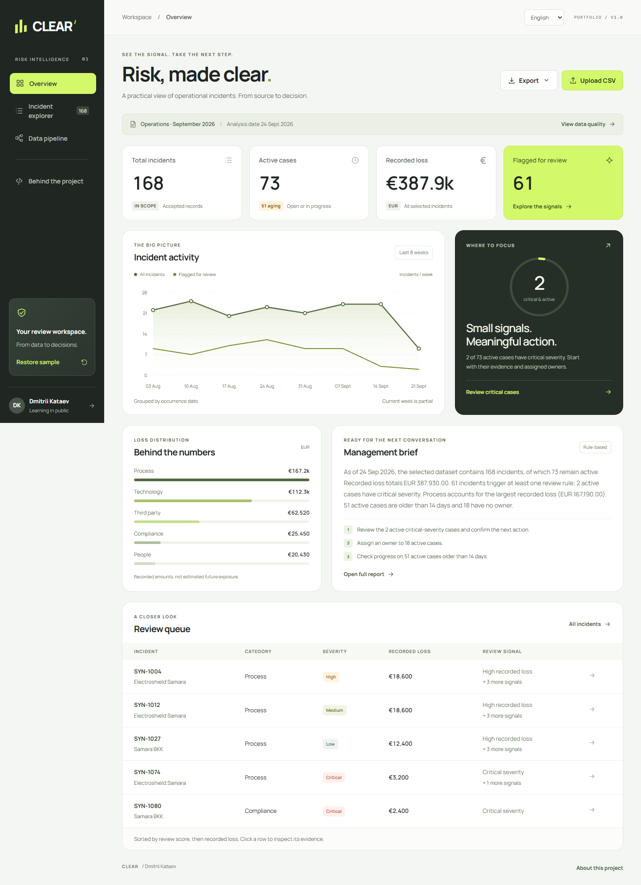

# CLEAR — Risk Intelligence

A practical Python portfolio project by **Dmitrii Kataev**: synthetic CSV → validation and cleaning → explainable review flags → management report.

**AI-assisted learning project. Synthetic data only.** This is an independent demonstration, not commercial banking experience, an RBI product, an endorsed implementation, or a validated risk model. No qualifications, employment history, or measured business impact are claimed.



## Start on Windows

1. Extract the whole project to a normal folder. Do not launch from inside a ZIP.
2. Install Python **3.11 or newer** if it is not already installed. Enable “Add Python to PATH”.
3. Double-click **`run_windows.bat`**. First launch installs dependencies in a project-local virtual environment.
4. The browser opens **http://127.0.0.1:5000**. Keep the terminal window open; Ctrl+C stops the server.

If the port is occupied, open a terminal in this folder and run `run_windows.bat --port 5055`.

The initial dependency installation needs internet. Normal use is local and works offline: the application, font, icons, sample data and charts do not use a CDN, analytics, or an external AI API.

**Русская инструкция:** [README_RU.md](README_RU.md).

Use the **English / Русский** selector in the top bar to change the interface and management report language. Your active dataset, filters and current section are preserved. Company names stay in English. The sample company names are placeholders; the generated incidents do not describe their actual operations.

Manual setup (Windows):

```powershell
py -3 -m venv .venv
.\.venv\Scripts\python.exe -m pip install -r requirements.lock
.\.venv\Scripts\python.exe app.py --open
```

macOS/Linux:

```sh
python3 -m venv .venv
.venv/bin/python -m pip install -r requirements.lock
.venv/bin/python app.py
```

## What to try in three minutes

1. Open **Overview**. The seeded dataset has 175 source rows, 168 accepted incidents, four exact duplicates and three deliberately invalid records. Analysis is fixed at **2026-09-24** so the demo remains reproducible.
2. Select **Review critical cases**. Inspect an incident to see the exact rule, review score, source row, owner and age at the analysis date.
3. Open **Data pipeline**. See what was normalized and why rows were rejected. Download the sample CSV and change a few values.
4. Upload the synthetic CSV. Select an analysis date, then **Validate CSV**. Inspect the results before choosing **Apply accepted records**. Closing the dialog cancels the switch.
5. Filter the incident register. Export the selected records as CSV/JSON, or open the management report and choose **Print / save as PDF**.

The **Restore sample** action returns to the built-in data. It does not overwrite uploaded source files.

## Why this project fits the intended application

The [RBI Student Job — Data & AI Automation](https://jobs.rbinternational.com/job/Wien-Student-Job-%28fmx%29-Data-%26-AI-Automation-%2820-25-hweek%29-Vien-1030/1370550757/) describes Python automation, data preparation, small internal tools, and risk reporting. CLEAR demonstrates a bounded learning exercise in those areas.

| Area | Working evidence in this project |
| --- | --- |
| Python automation | Browser-independent CLI runs the same validation and analysis functions |
| Data preparation | Schema validation, normalization, exact-duplicate removal, row-level rejection log |
| Risk reporting | Transparent demonstration rules, deterministic management brief, consistent exports |
| Backend/API | Flask factory and blueprint, session-scoped SQLite records, JSON endpoints |
| Responsible AI use | AI assistance is disclosed; no invented experience or hidden LLM-generated decisions |

**Power BI and Databricks are not implemented.** The cleaned CSV is suitable for a later BI exercise; this does not claim those skills. The vacancy's education and other eligibility requirements remain separate from the portfolio.

## Architecture

```text
Browser (HTML + CSS + plain JavaScript)
    │ same-origin JSON requests, session cookie + CSRF token
    ▼
Flask app factory / blueprint
    ├── pipeline.py     parsing, cleaning, validation, quality log
    ├── analysis.py     review rules, trend, aggregates, summary
    └── repository.py   SQLite datasets + incident rows, atomic writes
                          │
                          └── instance/clear.sqlite3 (local, ignored by Git)

CLI ──► the same pipeline.py and analysis.py ──► JSON report
```

The app calculates money in **integer euro cents** after Decimal parsing. Display formatting is a separate step. Filtering happens **after** full-dataset outlier calculation; a filter does not silently change a record's flags. Dashboard and report exports use the same analysis path.

```text
app.py                 Local Waitress entry point; loopback only, debug off
clear/__init__.py      App factory, configuration, headers, CSRF
clear/routes.py        HTTP endpoints and exports
clear/pipeline.py      Pure CSV processing functions
clear/analysis.py      Pure explainable analysis functions
clear/repository.py    SQLite persistence and session ownership
clear/cli.py           Browser-independent automation
clear/templates/      Dashboard and printable report
clear/static/         Self-contained interface, font, SVG icons
data/                 Public synthetic CSV
scripts/              Reproducible dataset generator
sql/                  Read-only SQLite analysis examples
tests/                Data, boundary, isolation and export checks
docs/                 Walkthrough, design decisions and test evidence
```

## CSV contract

Required columns:

```csv
incident_id,occurred_on,category,business_unit,severity,status,loss_eur
SYN-001,2026-09-01,Technology,Payments,High,Open,1250.50
```

Optional columns: `owner`, `description`. Download the sample in the interface for a full dataset.

| Field | Behavior |
| --- | --- |
| `incident_id` | 1–40 ASCII letters, digits, `_` or `-`; converted to uppercase |
| `occurred_on` | `YYYY-MM-DD`, `DD.MM.YYYY`, or `DD/MM/YYYY`; normalized to ISO; between 2000-01-01 and selected analysis date |
| `category` | Required text. Known labels normalized: Process, Technology, Third party, People, Compliance. Other labels retained |
| `business_unit` | Required text, surrounding/repeated whitespace normalized |
| `severity` | Low, Medium, High, Critical, case-insensitive |
| `status` | Open, In progress, Resolved; `Closed` maps to Resolved; `in_progress` also accepted |
| `loss_eur` | Nonnegative EUR amount, at most two decimal places, maximum EUR 100,000,000 |
| `owner` | Empty becomes `Unassigned`, which can trigger a review flag |
| `description` | Optional text; whitespace normalized; shown as text, not HTML |

- UTF-8 (with or without BOM); commas or semicolons; quoted values supported. Semicolons are useful for decimal-comma data.
- Header names are trimmed, lowercased, and spaces/hyphens become underscores. Duplicate headers or missing required columns reject the file.
- Unknown columns are ignored **and listed** in the quality report. Cells in supported columns are limited to 500 characters.
- The upload including form data must fit in 2 MiB; at most 10,000 non-empty records.
- Currency examples: `1250.50`, `1250,50`, `1,250.50`, `1.250,50`, `EUR 1,250.50`. Currency text and spaces are removed. **A single separator followed by exactly three digits is a thousands separator** (`1,250` and `1.250` both mean 1250). This is a documented convention, not locale inference.
- Negative, missing, nonfinite, scientific-notation and malformed amounts are rejected. Missing loss is never replaced with zero.
- Exact duplicates are detected after normalization. Conflicting duplicate IDs keep the first valid record and reject later conflicting records.
- Blank rows are skipped and counted separately. Source-row identifiers count CSV records (header = 1); a quoted multiline field remains one record.
- A structurally unreadable CSV, all-invalid file, oversized file, or row-limit breach rejects the entire upload. Other row errors allow a preview of the accepted subset.

## Explainable review rules

All thresholds below are illustrative choices, **not RBI policy**.

| Rule | Condition | Score weight |
| --- | --- | ---: |
| Critical severity | Active and Critical | 40 |
| High recorded loss | EUR 10,000 or more; any status | 25 |
| Aging case | Active and more than 14 days since occurrence | 15 |
| No owner | Active and Unassigned | 10 |
| Loss outlier | Category loss > Q3 + 1.5 × IQR, at least 8 records, IQR > 0 | 10 |

Active = Open or In progress. A resolved case can still trigger a loss flag. Quartiles use Python's `statistics.quantiles(method="inclusive")`. Outlier cohorts include all accepted records in that category. The weighted score is 0–100 and only orders a review queue; it is not a probability or an official severity measure.

Recorded loss includes resolved cases. It is not outstanding exposure, realized business impact attributed to the author, or a prediction. The 8-week chart groups by occurrence date; the current week is explicitly partial. Cases older than that chart window remain in the metrics and tables.

## Exports and automation

- **CSV**: every selected accepted record, review flags, source row, analysis date, and synthetic/learning disclosure. Formula-like spreadsheet text receives a leading apostrophe on export.
- **JSON**: complete selection, quality log, rules and aggregated report. Useful for downstream automation.
- **Management report**: server-rendered HTML, with print stylesheet and browser Save as PDF. Contains up to 15 highest-ranked flagged cases; bulk exports include the full selection.
- **Validation CSV**: excluded rows and reasons for the full dataset, independent of filters.

Run an unattended analysis without starting Flask:

```powershell
.\.venv\Scripts\python.exe -m clear.cli data/demo_incidents.csv --as-of 2026-09-24 --output work/report.json
```

The CLI refuses to overwrite an existing report and exits with code 2 on invalid input. It shares the application's business logic; no parallel set of rules is maintained.

## Tests

```powershell
.\.venv\Scripts\python.exe -m pip install -r requirements-dev.txt
.\.venv\Scripts\python.exe -m pytest -q
```

Or double-click `run_tests.bat` after first setup. See [validation notes](docs/VALIDATION.md) for the environment and browser checks actually performed. See [interview walkthrough](docs/INTERVIEW_GUIDE_RU.md) to prepare an honest project explanation.

The optional browser workflow is in `scripts/browser_smoke.py`; see the validation notes for its separate dependencies. Endpoint details are in [API reference](docs/API.md).

## Local storage and boundaries

- Default server: **127.0.0.1 only**, Waitress, no debug mode. There is no login or production authorization system.
- Uploaded records are scoped to the signed anonymous browser session. Another session cannot activate their dataset ID. The public demo is shared and immutable.
- Raw uploaded files are not retained by the application. Accepted rows and validation metadata are stored in the local SQLite database. Flask/Werkzeug may temporarily spool the multipart body while processing.
- Keep the latest 20 uploaded/pending datasets per browser, plus the current active dataset if older. Uploads older than seven days are pruned on the next successful upload, excluding that browser's current active dataset. This is lazy cleanup, not a scheduled retention service.
- A canceled preview can remain in local storage until that cleanup. Session/cookie reset makes earlier uploads inaccessible from the browser. Stop the app and delete `instance/` to reset **all** local app data and the session key.
- The development session secret is generated in `instance/.secret`. Set `CLEAR_SECRET_KEY` in a deployed environment. Never publish `instance/`, `.venv/`, or real data.
- Request-size limits, CSRF checks, parameterized SQL, HTML escaping, formula-safe CSV, CSP, frame restrictions and no-store responses are included. These are practical safeguards for a local demo, not a production security certification.
- Before public hosting: choose a Python-capable host, configure HTTPS and secure cookies, proper identity/access controls, rate limits, retention, logging, operational monitoring and a review of deployment requirements. No public deployment is claimed here. Do not use real customer or employee data.

## Reproduce or extend

`python scripts/generate_demo.py` recreates the CSV with seed 42. The seeded database is created only when absent; after intentionally changing the sample, restart with a fresh `instance/` if you want the UI seed updated.

Possible next learning exercises: a real Power BI report over the reviewed CSV; a Databricks notebook using the same synthetic dataset; proper schema migrations; multiuser authorization. These are future exercises, not existing features or experience.

**Typography:** Manrope, self-hosted under SIL Open Font License; license in `clear/static/fonts/OFL.txt`. Icons and data charts are local SVG. Project information is intentionally limited to the name and the disclosed learning work.

## Samara company placeholders

At the project owner's request, the built-in sample uses three real company names as display placeholders in `business_unit` (Company / unit). All associated incidents, amounts and assignments are fictional; the companies are not clients or partners of this project. Names/location references: [Электрощит Самара](https://www.electroshield.ru/contacts/), [Самарский БКК](https://sbkk.ru/kontakty/), [Жигулевское пиво](https://www.samarabeer.ru/contacts/). English company names appear without repeated labels. The disclosure remains in About this project and exported reports.


## Interface language

Use English / Русский in the top bar. A browser preference cookie remembers the language. Changing language preserves the current section, filters and active dataset. CSV columns and stored enum values remain stable; their on-screen labels and printable reports are localized.
